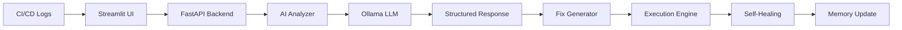
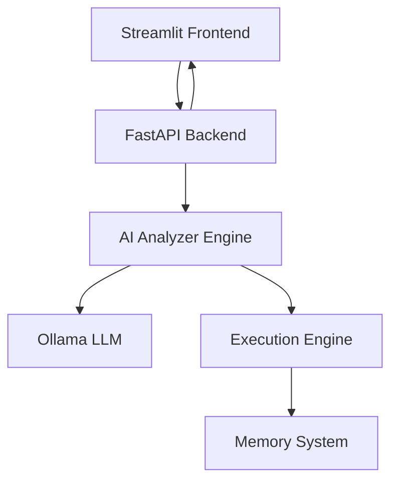
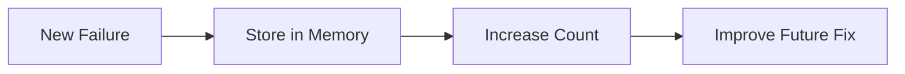

# 🚀 AutoFix CI — Self-Healing DevOps AI

### ⚡ AI-Powered Jenkins Pipeline Analyzer & Autonomous DevOps Agent

> Turning CI/CD failures into **automated, intelligent recovery systems**

---

# 📑 Table of Contents

* [🔥 Overview](#-overview)
* [🧠 Key Innovation](#-key-innovation)
* [⚙️ Workflow](#️-workflow)
* [🌟 Features](#-features)
* [🏗️ Architecture](#️-architecture)
* [📡 API Design](#-api-design)
* [🐳 Setup & Deployment](#-setup--deployment)
* [📂 Project Structure](#-project-structure)
* [🧪 Example](#-example)
* [📊 Learning System](#-learning-system)
* [🔮 Future Scope](#-future-scope)
* [🎯 Why This Project Stands Out](#-why-this-project-stands-out)
* [👨‍💻 Team](#-team)
* [📌 Final Thought](#-final-thought)

---

# 🔥 Overview

AutoFix CI is an **AI-driven DevOps system** that:

* 🔍 Analyzes CI/CD logs automatically
* 🧠 Identifies root causes using LLMs
* 🛠 Generates step-by-step fixes
* ⚡ Executes safe self-healing actions
* 📊 Learns from past failures

---

# 🧠 Key Innovation

Unlike traditional tools:

✔ No rule-based debugging
✔ Works on unseen logs
✔ AI-first reasoning
✔ Self-learning memory system
✔ Fully containerized architecture

---

# ⚙️ Workflow



---

# 🌟 Features

## 🤖 AI Log Analysis

* Detects failure patterns automatically
* Extracts:

  * Error type
  * Root cause
  * Fix plan

---

## 🛠 Intelligent Fix Engine

* Generates multi-step solutions
* Context-aware recommendations
* Works on unknown logs

---

## ⚡ Self-Healing Execution

* Executes safe commands
* Verifies fixes automatically
* Prevents unsafe operations

---

## 📊 Learning Dashboard

* Tracks failures dynamically
* Displays frequency trends
* Improves system intelligence

---

## 📈 Dynamic Accuracy Score

* Based on:

  * AI confidence
  * Past success rate

---

# 🏗️ Architecture



---

# 📡 API Design

## 🔹 Analyze Pipeline Logs

```http
POST /analyze
```

### Request

```json
{
  "log": "Jenkins pipeline log"
}
```

### Response

```json
{
  "ai_analysis": {
    "error_type": "Build Timeout",
    "root_cause": "Long-running task",
    "fix": "Increase timeout"
  },
  "exec_fix": {
    "type": "auto",
    "commands": ["increase timeout"]
  },
  "accuracy": 85
}
```

---

## 🔹 Get Learning Data

```http
GET /memory
```

---

# 🐳 Setup & Deployment

## 🚀 Run Full System

```bash
docker-compose up --build
```

---

## 🧠 Pull AI Model (First Time)

```bash
docker exec -it ollama ollama pull llama3
```

---

## 🌐 Access

| Service   | URL                    |
| --------- | ---------------------- |
| UI        | http://localhost:8501  |
| Backend   | http://localhost:8000  |
| AI Engine | http://localhost:11434 |

---

# 📂 Project Structure

```
Hack2Hire/
│
├── backend/
│   ├── api.py
│   ├── final_analyzer.py
│   ├── executor.py
│   ├── Dockerfile
│   ├── requirements.txt
│
├── frontend/
│   ├── app.py
│   ├── Dockerfile.streamlit
│   ├── requirements.txt
│
├── docker-compose.yml
├── memory.json
├── safety.py
├── README.md
```

---

# 🧪 Example

### Input Log

```
ERROR: Repository not found
fatal: Authentication failed
```

---

### AI Output

* Error Type: Git Authentication Failure
* Root Cause: Invalid credentials
* Fix Plan:

  1. Verify credentials
  2. Use access token
  3. Retry pipeline

---

# 📊 Learning System



---

## Sample Memory

```json
{
  "failures": [
    {
      "error": "build timeout",
      "count": 3
    }
  ]
}
```

---

# 🔮 Future Scope

* 🔗 Jenkins integration
* 🤖 Fully autonomous pipelines
* ☁️ Cloud deployment
* 📊 Advanced analytics dashboard
* 🔁 Continuous learning loop

---

# 🎯 Why This Project Stands Out

✔ Fully AI-driven
✔ Self-healing capability
✔ Real-world DevOps application
✔ Microservice architecture
✔ Dynamic learning system

---

# 👨‍💻 Team

**Team 404 ERROR**

* Gagan M
* Abhisek M

---

# 📌 Final Thought

AutoFix CI is not just a tool —
it’s a step toward **autonomous DevOps systems** 🚀
