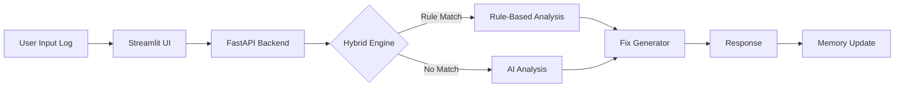
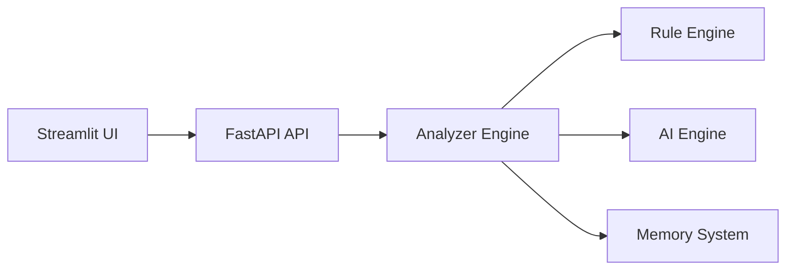

# 🚀 AutoFix CI — Self-Healing DevOps AI

### ⚡ Intelligent, Adaptive CI/CD Failure Analyzer

> From static debugging → to a **self-learning, API-driven DevOps system**

---

## 📑 Table of Contents

* [Live System Status](#-live-system-status)
* [What Makes This Dynamic](#-what-makes-this-dynamic)
* [Dynamic Workflow](#️-dynamic-workflow)
* [Key Capabilities](#-key-capabilities-live-behavior)
* [System Architecture](#️-system-architecture-production-ready)
* [API-Driven Design](#-api-driven-design)
* [Project Structure](#-project-structure-evolving-system)
* [Run the System](#-run-the-system)
* [Dynamic Example](#-dynamic-example)
* [Future Evolution](#-future-evolution)
* [Why This Project Stands Out](#-why-this-project-stands-out)
* [Team](#-team)
* [Final Thought](#-final-thought)

---

## 🔥 Live System Status

* 🟢 Backend: FastAPI Microservice
* 🟢 Frontend: Streamlit UI
* 🟢 AI Engine: LLaMA3 (via Ollama)
* 🟢 Mode: Hybrid (Rule + AI + Fallback)
* 🧠 Memory: Continuously learning

---

## 🧠 What Makes This Dynamic

AutoFix CI is **not a static analyzer** — it evolves:

* Learns from past failures (`memory.json`)
* Switches between Rule-based & AI reasoning
* Falls back intelligently when systems fail
* Adapts to unseen logs without retraining
* Operates via real-time API architecture

---

## ⚙️ Dynamic Workflow



---

## 🌟 Key Capabilities (Live Behavior)

### 🔍 Hybrid Intelligence

* Detects known patterns instantly
* Uses AI for unknown issues
* Combines both for higher accuracy

### 🧠 Self-Learning Memory

* Stores failures dynamically
* Improves suggestions over time
* Tracks frequency of errors

### 🛠 Smart Fix Engine

* Generates contextual fixes
* Suggests commands and best practices

### 🔁 Pipeline Simulation

* Visualizes failure → success
* Validates fix effectiveness

### 📊 Dynamic Analytics

* Real-time failure trends
* Most frequent errors
* Confidence tracking

### 🤖 Autonomous Evaluation

* No labeled data required
* Measures confidence, consistency, clustering

---

## 🏗️ System Architecture (Production Ready)



---

## 📡 API-Driven Design

### Endpoint

```http
POST /analyze
```

### Request

```json
{
  "log": "jenkins error log here"
}
```

### Response

```json
{
  "rule": {...},
  "ai": {...},
  "fix": {...}
}
```

---

## 📂 Project Structure (Evolving System)

```
Hack2Hire/
 ├── app.py              # Streamlit UI (Client)
 ├── api.py              # FastAPI Backend (Server)
 ├── final_analyzer.py   # Intelligence Engine
 ├── memory.json         # Learned Knowledge Base
 ├── logs.txt            # Sample logs
 ├── requirements.txt    # Dependencies
 ├── README.md           # Documentation
```

---

## 🚀 Run the System

### 1️⃣ Start Backend

```bash
python -m uvicorn api:app --reload
```

### 2️⃣ Start Frontend

```bash
python -m streamlit run app.py
```

---

## 🧪 Dynamic Example

### Input

```
docker: command not found
```

### System Behavior

* Rule Engine detects issue
* AI validates root cause
* Fix Engine generates solution
* Memory stores pattern

### Output

```
Error Type: Command Not Found  
Root Cause: Docker not installed  
Fix: Install Docker and verify PATH  
```

---

## 🔮 Future Evolution

* 🔗 Jenkins webhook automation
* 🐳 Dockerized deployment
* ☁️ Cloud hosting
* 📊 Advanced dashboards
* 🧠 Continuous learning

---

## 🎯 Why This Project Stands Out

✔ Hybrid AI + Rule-based system
✔ Microservice architecture
✔ Real-time API communication
✔ Self-learning memory
✔ Autonomous evaluation

---

## 👨‍💻 Team

**Team 404 ERROR**

* Gagan M
* Abhisek M

---

## 📌 Final Thought

AutoFix CI is not just a tool —
it’s a step toward **self-healing DevOps pipelines** 🚀

---
