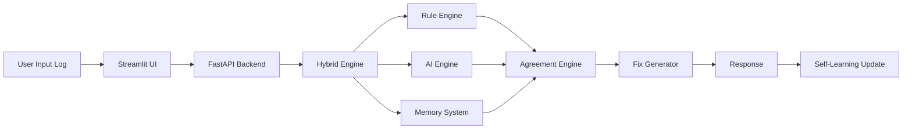
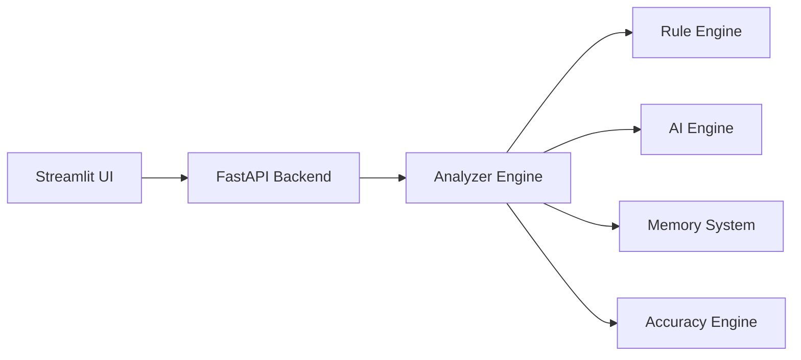

# 🚀 AutoFix CI — Self-Healing DevOps AI

### ⚡ Intelligent, Adaptive, Self-Learning CI/CD Failure Analyzer

> From static debugging → to a **self-learning, API-driven DevOps intelligence system**

---

## 📑 Table of Contents

* [Live System Status](#-live-system-status)
* [What Makes This Dynamic](#-what-makes-this-dynamic)
* [Advanced Workflow (New)](#-advanced-workflow-new)
* [Key Capabilities](#-key-capabilities-live-behavior)
* [System Architecture](#️-system-architecture-production-ready)
* [API-Driven Design](#-api-driven-design)
* [Project Structure](#-project-structure-evolving-system)
* [Run the System](#-run-the-system)
* [Dynamic Example](#-dynamic-example)
* [What’s New (Today’s Upgrade 🚀)](#-whats-new-todays-upgrade-)
* [Future Evolution](#-future-evolution)
* [Why This Project Stands Out](#-why-this-project-stands-out)
* [Team](#-team)
* [Final Thought](#-final-thought)

---

## 🔥 Live System Status

* 🟢 Backend: FastAPI Microservice
* 🟢 Frontend: Streamlit UI
* 🟢 AI Engine: LLaMA3 (via Ollama)
* 🟢 Mode: Hybrid (Rule + AI + Memory + Fallback)
* 🧠 Memory: Self-learning (with success tracking)
* 📊 Accuracy: Real-time evaluation (no manual input)

---

## 🧠 What Makes This Dynamic

AutoFix CI is **no longer static** — it evolves intelligently:

* Learns from past failures (`memory.json`)
* Tracks success rate of fixes
* Automatically selects best-performing solutions
* Uses AI + Rule + Memory agreement
* Adapts to unseen logs using AI reasoning
* Falls back intelligently if backend fails
* Operates via real-time API architecture

---

## ⚙️ Advanced Workflow (New)



---

## 🌟 Key Capabilities (Live Behavior)

### 🔍 Hybrid Intelligence

* Combines Rule + AI + Memory
* Handles both known & unknown failures
* Never returns empty results

### 🧠 Self-Learning Fix Engine (NEW 🚀)

* Tracks error frequency and fix success rate
* Automatically selects best fix
* Improves over time without retraining

### 📊 Real Accuracy Scoring (NEW 🚀)

* No manual input required
* Based on rule vs AI vs memory agreement
* Provides realistic confidence score

### 🛠 Advanced Fix Engine

* Step-by-step solutions
* Real command examples
* Best practices included

### 🔁 Smart Pipeline Simulation

* Shows failure → success transition
* Uses AI + accuracy score

### 📈 Learning Dashboard

* Tracks system learning and failure trends

### 🤖 Autonomous Evaluation

* Evaluates system across multiple logs
* Measures accuracy and consistency

---

## 🏗️ System Architecture (Production Ready)



---

## 📡 API-Driven Design

### Endpoint

POST /analyze

### Request

```json
{
  "log": "jenkins error log here"
}
```

### Response

```json
{
  "rule_based": {...},
  "memory": {...},
  "ai_analysis": {...},
  "fix": {...},
  "accuracy": 92
}
```

---

## 📂 Project Structure

```
Hack2Hire/
 ├── app.py
 ├── api.py
 ├── final_analyzer.py
 ├── memory.json
 ├── logs.txt
 ├── requirements.txt
 ├── Dockerfile
 ├── docker-compose.yml
 ├── README.md
```

---

## 🚀 Run the System

### Docker (Recommended)

```
docker-compose up --build
```

### Manual Run

```
python -m uvicorn api:app --reload
python -m streamlit run app.py
```

---

## 🧪 Dynamic Example

### Input

```
ERROR: Repository not found
fatal: Authentication failed
```

### Output

```
Error Type: Git/Auth Failure
Root Cause: Invalid credentials

Fix:
1. Use personal access token
2. Update git URL
3. Verify repository permissions

Accuracy: ~90%
```

---

## 🚀 What’s New (Today’s Upgrade 🚀)

* Real accuracy scoring (no manual input)
* Self-learning fix engine (success tracking)
* Improved hybrid AI logic
* Detailed step-by-step fixes
* API upgraded with accuracy + memory
* Enhanced UI explanations

---

## 🔮 Future Evolution

* Jenkins webhook automation
* Semantic AI (no pattern dependency)
* Vector database memory
* Cloud deployment

---

## 🎯 Why This Project Stands Out

✔ Self-learning system
✔ Real accuracy scoring
✔ Hybrid AI + Rule + Memory
✔ Microservice architecture
✔ Production-ready

---

## 👨‍💻 Team

Team 404 ERROR
Gagan M
Abhisek M

---

## 📌 Final Thought

AutoFix CI is not just a tool —
it’s a **self-improving DevOps intelligence system** 🚀
