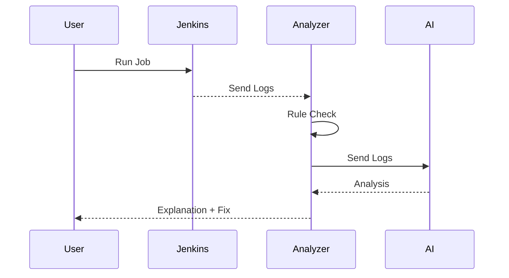

# 🤖 AutoFix CI — AI-Powered Jenkins Failure Analyzer

### 🚧 Hack2Hire Project | Self-Healing DevOps Assistant

> 💡 Transform Jenkins failures into clear explanations and actionable fixes using AI

---

## 📑 Table of Contents

* [Overview](#-overview)
* [Why This Project?](#-why-this-project)
* [Solution](#-solution)
* [System Architecture](#-system-architecture)
* [Pipeline Flow](#-pipeline-flow)
* [Key Features](#-key-features)
* [Tech Stack](#️-tech-stack)
* [Project Structure](#-project-structure)
* [Setup & Run](#-setup--run)
* [Example Output](#-example-output)
* [Future Scope](#-future-scope)
* [Team](#-team)

---

## 📌 Overview

AutoFix CI is an AI-powered DevOps assistant that analyzes Jenkins build failures and provides:

* ❌ Error identification
* 🧠 Root cause explanation
* 🛠️ Suggested fixes

It simplifies debugging by converting complex logs into understandable insights.

---

## 🚀 Why This Project?

Debugging CI/CD pipelines is often:

* Time-consuming
* Hard to understand
* Repetitive

Developers spend too much time reading logs instead of fixing issues.

---

## 💡 Solution

This system:

1. Reads Jenkins logs
2. Applies rule-based detection
3. Uses AI (LLaMA3 via Ollama)
4. Generates human-readable explanations
5. Stores insights for future use

---

## 🧠 System Architecture

```mermaid
flowchart LR
    A[Jenkins Job] --> B[Generate Logs]
    B --> C[Rule-Based Analyzer]
    C --> D[AI Analyzer (LLaMA3)]
    D --> E[Explanation + Fix]
    E --> F[Memory Storage]
```

---

## ⚙️ Pipeline Flow



---

## 🌟 Key Features

### 🧩 Smart Analysis

* Detects common Jenkins failures
* Identifies patterns like `exit 1`, command errors

### 🤖 AI-Powered Insights

* Uses LLaMA3 locally via Ollama
* Converts logs into simple explanations

### 🧠 Memory System

* Stores past failures in `memory.json`
* Helps improve future debugging

### ⚡ Fast Debugging

* Saves developer time
* Reduces manual effort

---

## 🛠️ Tech Stack

* **Jenkins** → CI/CD automation
* **Docker** → Containerization
* **Python** → Core logic
* **Ollama (LLaMA3)** → AI model
* **Streamlit** → UI

---

## 📂 Project Structure

```
Hack2Hire/
 ├── app.py                # Streamlit UI
 ├── final_analyzer.py     # Main analyzer logic
 ├── logs.txt              # Jenkins logs input
 ├── memory.json           # Stores past analysis
 ├── requirements.txt      # Dependencies
 ├── .gitignore            # Ignored files
 ├── README.md             # Documentation
 ├── LICENSE               # License file
```

---

## 🚀 Setup & Run

### 1️⃣ Install dependencies

```
pip install -r requirements.txt
```

### 2️⃣ Run analyzer

```
python final_analyzer.py
```

### 3️⃣ Run UI (optional)

```
python -m streamlit run app.py
```

---

## 🧪 Example Output

```
Error Type: Build Failure

Reason:
Script exited with non-zero status

Fix:
Remove 'exit 1' or correct script logic
```

---

## 🔮 Future Scope

* 🔧 Auto-fix Jenkins jobs
* 📩 Slack / Email integration
* 🌐 Support for GitHub Actions & GitLab CI
* 📊 Analytics dashboard

---

## 👨‍💻 Team

**Team 404 ERROR**

* Gagan M
* Abhisek M

---

## 📌 Conclusion

AutoFix CI enhances DevOps workflows by combining rule-based detection with AI-powered reasoning, making CI/CD debugging faster, smarter, and more efficient.

---
