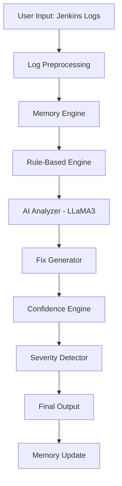
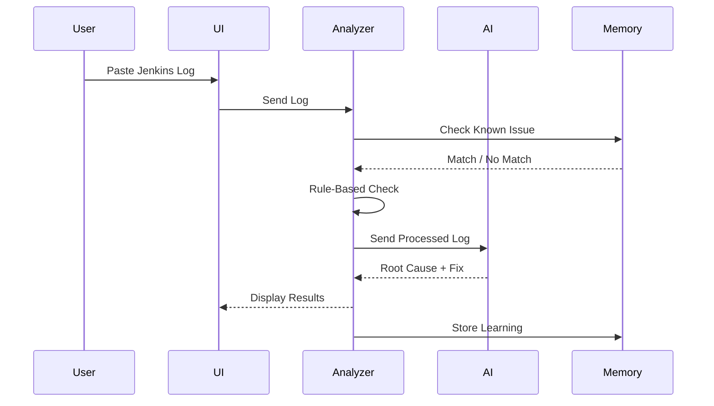
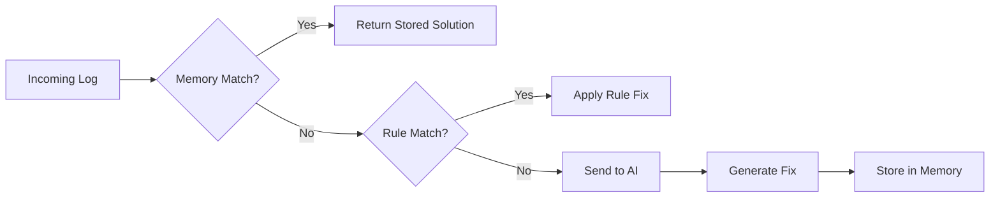

# 🚀 AutoFix CI — Self-Healing DevOps AI

### 🚧 Hack2Hire Project | Intelligent CI/CD Failure Analyzer

> 💡 Transform Jenkins failures into actionable insights using AI + rule-based intelligence

---

## 📑 Table of Contents

* [Overview](#-overview)
* [Why This Project?](#-why-this-project)
* [Solution](#-solution)
* [System Architecture](#-system-architecture)
* [Pipeline Flow](#-pipeline-flow)
* [Decision Engine Flow](#-decision-engine-flow-new)
* [Key Features](#-key-features)
* [Tech Stack](#️-tech-stack)
* [Project Structure](#-project-structure)
* [Setup & Run](#-setup--run)
* [Example Output](#-example-output)
* [Future Scope](#-future-scope)
* [Team](#-team)

---

## 📌 Overview

AutoFix CI is an **AI-powered DevOps assistant** that analyzes Jenkins pipeline failures and provides:

* ❌ Error identification
* 🧠 Root cause analysis
* 🛠 Actionable fixes
* 🔁 Learning from past failures

---

## 🚀 Why This Project?

Debugging CI/CD pipelines is:

* ⏳ Time-consuming
* 🧩 Hard to interpret
* 🔁 Repetitive

Developers waste time reading logs instead of fixing problems.

---

## 💡 Solution

AutoFix CI introduces a **multi-layer intelligent system**:

1. 🧹 Cleans noisy logs
2. 🧠 Checks past failures (memory system)
3. ⚙️ Applies rule-based detection
4. 🤖 Uses AI for deep reasoning
5. 🛠 Generates fixes
6. 📊 Calculates confidence & severity

---

## 🧠 System Architecture



---

## ⚙️ Pipeline Flow



---

## 🧠 Decision Engine Flow (NEW)



---

## 🌟 Key Features

### 🧹 Log Preprocessing (NEW 🔥)

* Filters only important error lines
* Improves AI accuracy

---

### 🧠 Memory Learning System

* Stores failures in `memory.json`
* Learns over time
* Reduces repeated debugging

---

### ⚙️ Rule-Based Engine

* Detects common failures instantly
* Example:

  * `exit 1`
  * `cannot run program`

---

### 🤖 AI-Powered Analysis

* Uses LLaMA3 via Ollama
* Provides human-readable explanations

---

### 🛠 Auto Fix Engine

* Suggests fixes
* Provides corrected commands

---

### 📊 Confidence Scoring

* Shows reliability of detection

---

### 🚨 Severity Detection (NEW 🔥)

* HIGH → Critical failure
* MEDIUM → Warning
* LOW → Minor issue

---

## 🛠️ Tech Stack

| Layer    | Technology      |
| -------- | --------------- |
| Backend  | Python          |
| UI       | Streamlit       |
| AI Model | LLaMA3 (Ollama) |
| API      | Requests        |
| Storage  | JSON            |

---

## 📂 Project Structure

```
Hack2Hire/
 ├── app.py
 ├── final_analyzer.py
 ├── logs.txt
 ├── memory.json
 ├── requirements.txt
 ├── .gitignore
 ├── README.md
 ├── LICENSE
```

---

## 🚀 Setup & Run

### 1️⃣ Install dependencies

```
pip install -r requirements.txt
```

### 2️⃣ Start AI Model

```
ollama run llama3
```

### 3️⃣ Run UI

```
streamlit run app.py
```

---

## 🧪 Example Output

### Input Log

```
+ echo Hello Jenkins
+ exit 1
Build step 'Execute shell' marked build as failure
```

### Output

* ❌ Error: Script Failure
* 📌 Reason: Script exited with non-zero status
* 🛠 Fix: Remove `exit 1`
* 📊 Confidence: 95%
* 🚨 Severity: HIGH

---

## 🔮 Future Scope

* 📊 Analytics dashboard
* 🔁 Auto pipeline healing
* ☁️ Cloud deployment
* 🔗 GitHub Actions integration
* 🤖 Multi-agent AI system

---

## 👨‍💻 Team

**Team 404 ERROR**

* Gagan M
* Abhisek M

---

## 📌 Conclusion

AutoFix CI transforms DevOps debugging by combining:

* Rule-based intelligence
* AI reasoning
* Memory-based learning

➡️ Making CI/CD pipelines smarter, faster, and self-healing 🚀
